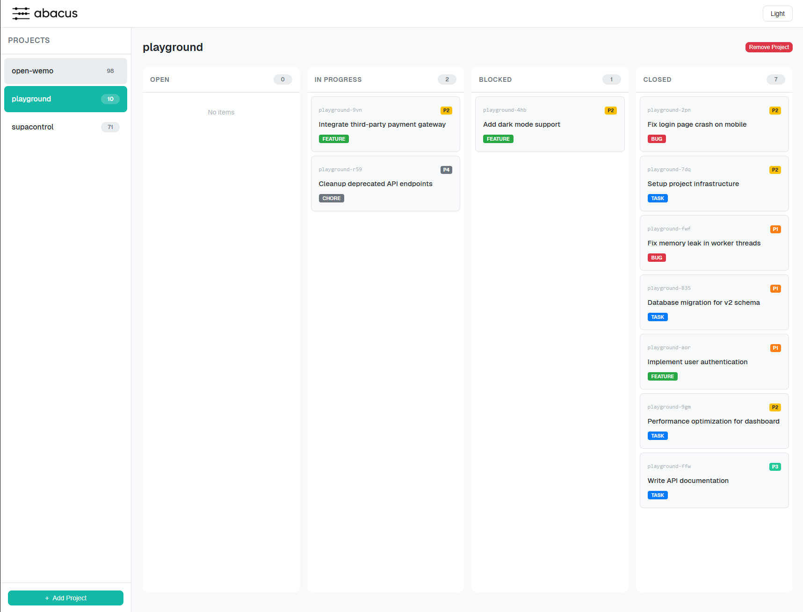
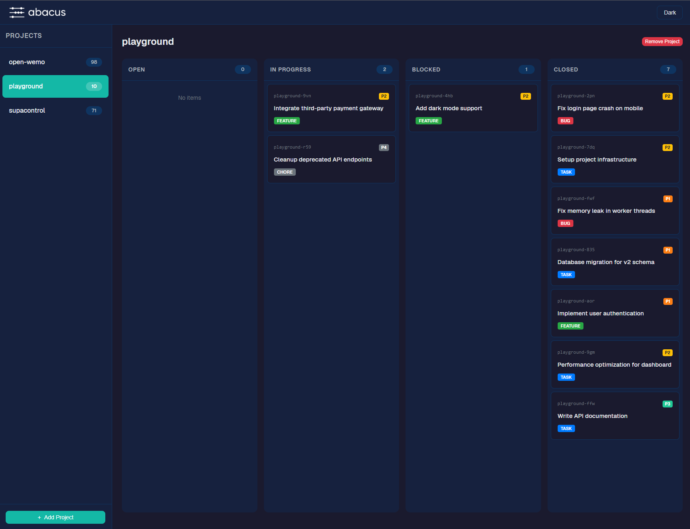
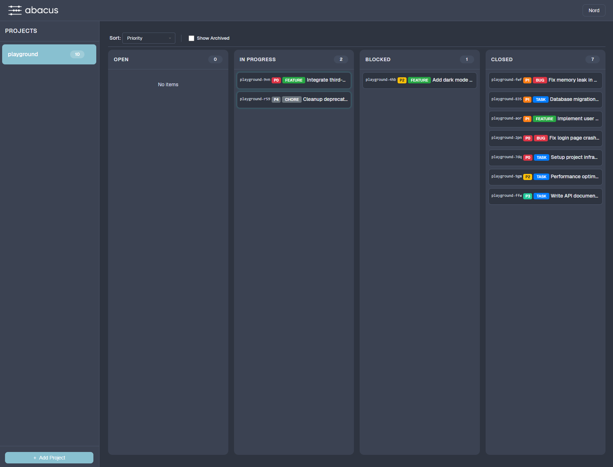

<p align="center">
  
</p>

<h1 align="center">Abacus</h1>

<p align="center">
  <strong>A lightweight dashboard for visualizing and monitoring beads (issues) across multiple projects</strong>
</p>

<p align="center">
  <a href="https://github.com/haal-laah/abacus/releases"></a>
  <a href="https://github.com/haal-laah/abacus/blob/main/LICENSE"></a>
</p>

<p align="center">
  <a href="#features">Features</a> &bull;
  <a href="#installation">Installation</a> &bull;
  <a href="#quick-start">Quick Start</a> &bull;
  <a href="#usage">Usage</a> &bull;
  <a href="#themes">Themes</a> &bull;
  <a href="#development">Development</a> &bull;
  <a href="#contributing">Contributing</a>
</p>

---

## What is Abacus?

Abacus is a real-time dashboard for [beads](https://github.com/steveyegge/beads) - a lightweight issue tracking system that stores issues as local files. Think of it as a visual Kanban board for your beads projects.

**Why Abacus?**

| Challenge | Abacus Solution |
|-----------|-----------------|
| Beads are stored as files - hard to visualize | **Kanban board** - See all issues organized by status |
| Multiple projects with beads | **Multi-project support** - Switch between projects instantly |
| No real-time updates when issues change | **Live updates** - Dashboard refreshes automatically via SSE |
| Command-line only workflow | **Visual interface** - Click to view issue details, navigate dependencies |

## Features

- **Kanban Board** - Visualize beads organized by status (Open, In Progress, Blocked, Closed)
- **Multi-Project Support** - Register and switch between multiple beads projects
- **Real-Time Updates** - Automatically refreshes when beads data changes (file watching + SSE)
- **Folder Browser** - Visual folder picker to find and add beads projects
- **Dependency Navigation** - Click through issue dependencies in the detail modal
- **Theme Support** - Light, Dark, Nord, and Warm themes with persistent preference
- **Responsive Design** - Works on desktop and tablet
- **Zero Database** - Uses your existing beads files, no additional storage needed

## Installation

### Prerequisites

- Node.js 18+ (LTS recommended)
- npm or pnpm

### Setup

```bash
# Clone the repository
git clone https://github.com/haal-laah/abacus.git
cd abacus

# Install dependencies
npm install

# Start the server
npm start
```

Open your browser to [http://localhost:3000](http://localhost:3000)

## Quick Start

1. **Start Abacus**
   ```bash
   npm start
   ```

2. **Add a Project**
   - Click "Add Project" in the sidebar
   - Click "Browse" to navigate to your project folder, or enter the path manually
   - Select a folder containing a `.beads` directory

3. **View Your Beads**
   - Click on a project in the sidebar to see its Kanban board
   - Beads are organized into columns by status
   - Click any bead card to view full details

4. **Watch for Changes**
   - Abacus automatically watches for file changes
   - When you update beads via CLI, the dashboard updates in real-time

## Usage

### Adding Projects

Projects must contain a `.beads` directory with either:
- `issues.jsonl` - JSONL format issue file
- `beads.db` - SQLite database

Use the folder browser or enter a path directly:

```
/path/to/your/project
├── .beads/
│   ├── issues.jsonl   # or beads.db
│   └── ...
└── ...
```

### Removing Projects

1. Select the project in the sidebar
2. Click "Remove Project" in the board header
3. Confirm removal

> **Note**: This only unregisters the project from Abacus. It does not delete any beads data.

### Keyboard Shortcuts

| Key | Action |
|-----|--------|
| `Escape` | Close modal |
| Click overlay | Close modal |

### Configuration

Abacus stores its configuration in:
- **macOS/Linux**: `~/.abacus/projects.json`
- **Windows**: `%USERPROFILE%\.abacus\projects.json`

### Environment Variables

| Variable | Default | Description |
|----------|---------|-------------|
| `PORT` | `3000` | Server port |

## Themes

Abacus includes four built-in themes. Click the theme button in the header to cycle through them. Your preference is saved to localStorage.

<p align="center">
  <a href=".github/assets/light.png" target="_blank"></a>
  <a href=".github/assets/dark.png" target="_blank"></a>
  <a href=".github/assets/nord.png" target="_blank"></a>
  <a href=".github/assets/warm.png" target="_blank"></a>
</p>

<p align="center">
  <sub>Light &nbsp;&nbsp;&nbsp;&nbsp;&nbsp;&nbsp;&nbsp;&nbsp;&nbsp;&nbsp;&nbsp;&nbsp;&nbsp;&nbsp;&nbsp;&nbsp;&nbsp;&nbsp;&nbsp;&nbsp;&nbsp;&nbsp;&nbsp;&nbsp;&nbsp;&nbsp;&nbsp;&nbsp;&nbsp; Dark &nbsp;&nbsp;&nbsp;&nbsp;&nbsp;&nbsp;&nbsp;&nbsp;&nbsp;&nbsp;&nbsp;&nbsp;&nbsp;&nbsp;&nbsp;&nbsp;&nbsp;&nbsp;&nbsp;&nbsp;&nbsp;&nbsp;&nbsp;&nbsp;&nbsp;&nbsp;&nbsp;&nbsp;&nbsp;&nbsp; Nord &nbsp;&nbsp;&nbsp;&nbsp;&nbsp;&nbsp;&nbsp;&nbsp;&nbsp;&nbsp;&nbsp;&nbsp;&nbsp;&nbsp;&nbsp;&nbsp;&nbsp;&nbsp;&nbsp;&nbsp;&nbsp;&nbsp;&nbsp;&nbsp;&nbsp;&nbsp;&nbsp;&nbsp;&nbsp; Warm</sub>
</p>

| Theme | Description |
|-------|-------------|
| **Light** | Clean, bright interface (default) |
| **Dark** | Easy on the eyes for low-light environments |
| **Nord** | Arctic, bluish color palette |
| **Warm** | Sepia-toned, comfortable for extended use |

## Tech Stack

- **Backend**: Node.js with built-in `http` module (no Express needed)
- **Frontend**: Vanilla JavaScript with Web Components (Shadow DOM)
- **Storage**: JSON file for project registry, reads beads from your projects
- **File Watching**: `chokidar` for real-time updates
- **Real-Time**: Server-Sent Events (SSE)


## Development

```bash
# Install dependencies
npm install

# Start development server (auto-restarts on changes)
npm run dev
```

### Project Structure

```
abacus/
├── public/
│   ├── components/      # Web Components (Shadow DOM)
│   ├── styles/          # CSS tokens and fonts
│   ├── themes/          # Theme CSS files
│   ├── app.js           # Frontend application
│   └── index.html       # Entry point
├── server.js            # Node.js HTTP server
└── package.json
```

### Adding a New Theme

1. Create `public/themes/mytheme.css`:
   ```css
   [data-theme="mytheme"] {
     --color-bg-primary: #...;
     --color-text-primary: #...;
     /* ... see existing themes for all variables */
   }
   ```

2. Import in `public/index.html`:
   ```html
   <link rel="stylesheet" href="themes/mytheme.css">
   ```

3. Add to theme cycle in `public/app.js`:
   ```javascript
   const themes = ['light', 'dark', 'nord', 'warm', 'mytheme'];
   ```

4. Update `_updateThemeLabel()` in `public/components/abacus-header.js`

## API Reference

### Endpoints

| Method | Endpoint | Description |
|--------|----------|-------------|
| `GET` | `/api/projects` | List all registered projects |
| `POST` | `/api/projects` | Add a new project |
| `DELETE` | `/api/projects/:id` | Remove a project |
| `GET` | `/api/projects/:id/beads` | Get beads for a project |
| `GET` | `/api/browse?path=` | Browse filesystem directories |
| `GET` | `/api/events` | SSE stream for real-time updates |

### Beads Data Format

Abacus reads beads from `.beads/issues.jsonl` or `.beads/beads.db`. Each bead has:

```json
{
  "id": "bd-a1b2",
  "title": "Fix authentication bug",
  "description": "Users can't log in with OAuth",
  "status": "open",
  "priority": 1,
  "type": "bug",
  "assignee": "alice",
  "labels": ["backend", "urgent"],
  "created_at": "2025-01-10T14:30:00Z",
  "updated_at": "2025-01-12T09:15:00Z",
  "dependencies": [{"type": "blocks", "target": "bd-f14c"}]
}
```

| Status | Description |
|--------|-------------|
| `open` | Not started |
| `in_progress` | Being worked on |
| `blocked` | Waiting on dependencies |
| `closed` | Completed |

| Priority | Level |
|----------|-------|
| `0` | P0 - Urgent |
| `1` | P1 - High |
| `2` | P2 - Medium |
| `3` | P3 - Low |
| `4` | P4 - Backlog |

## Contributing

We welcome contributions! See [CONTRIBUTING.md](./CONTRIBUTING.md) for guidelines.

```bash
# Fork and clone
git clone https://github.com/YOUR_USERNAME/abacus.git
cd abacus

# Create a branch
git checkout -b feat/your-feature

# Make changes and submit a PR
```

## License

MIT - see [LICENSE](./LICENSE) for details.

---

<p align="center">
  <sub>Built for the beads ecosystem</sub>
</p>
